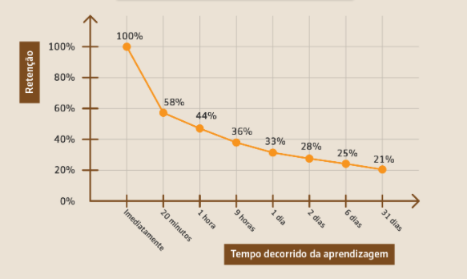
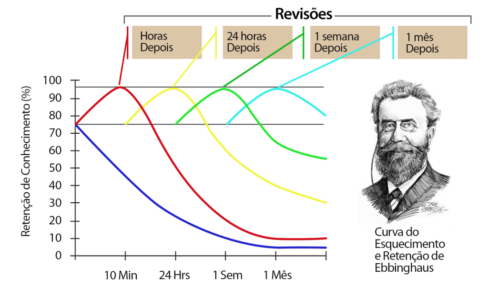

# A utilidade dos flashcards

Já pensou se você pudesse lembrar de tudo que aprende durante os seus estudos? Bom, a verdade é que apesar de o nosso cérebro ser incrível, temos algumas falhas, porém podemos resolver isso. Quando aprendemos algo novo, se não colocarmos isso em prática, ou não voltarmos a ter contato com o que acabamos de aprender, a tendência é que venhamos a esquecer essa informação. Isso é simples de se entender: o cérebro entende que se algo não é importante para nós, logo, pode ser colocado em segundo plano. Veja abaixo a **Curva do esquecimento** para ter uma ideia de como nos lembramos do que aprendemos.

Se você não entendeu o gráfico, resumindo em poucas palavras, quanto mais tempo se passa a partir do momento que você aprendeu algo, mais chances você tem de esquecer aquilo. A melhor maneira de evitar que isso aconteça é revisando ou “treinando” o que você aprendeu, sempre com intervalos de alguns dias entre uma revisão e outra. É aí que entra o Anki, que é um programa de computador que vai lhe ajudar a revisar/treinar tudo aquilo que você estuda. Veja como se comporta a Curva do esquecimento com as revisões do Anki:

Interessante e muito elucidativo, não? Se você quiser entender melhor sobre como funciona o Anki, veja o tutorial que escolhemos no YouTube para você ou baixe o Anki diretamente.

<ButtonGroup>
  <Button type="primary" href="/Como utilizar o Anki">Como utilizar o Anki</Button>
  <Button type="secondary" href="/Baixar e instalar o Anki">Baixar e instalar o Anki</Button>
</ButtonGroup>